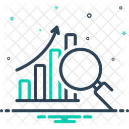

<!-- PROJECT SHIELDS -->
<!--
*** I'm using markdown "reference style" links for readability.
*** Reference links are enclosed in brackets [ ] instead of parentheses ( ).
*** See the bottom of this document for the declaration of the reference variables
-->
[![Streamlit][framework-shield]][framework-url]
[![Python][python-shield]][python-url]
[![Heroku][heroku-shield]][heroku-url]
[![LinkedIn][linkedin-shield]][linkedin-url]

<!-- PROJECT LOGO -->
 

  

  <h3 align="center">Simple EDA App</h3>

  

    A simple app to perform basic Data Analysis operations on a csv/excel file!
  

<!-- ABOUT THE PROJECT -->
## About The Project

[![Simple EDA App][product_screenshot]][app_launch-url]

This is a simple web application which can perform some of the basic Exploratory Data Analysis on any csv or excel files. Following are the funcionalities of the app:
* Chosse a local file (csv or excel), or choose a predefined file to begin the analysis
* Preview the dataset as per number of rows and columns selected
* Highlight number of missing values in each column
* Display datatypes of each column
* Display number of unique values in a column
* Display summary of numerical columns of the dataset
* Visualise heatmap of correlation matrix
* Display pie plot, bar plot, line plot, box plot, histogram, distribution plot

The EDA is the first operation on a dataset. This app performs some of the general functionalities on a csv file or excel file. Hope it helps to reduce the effort in writing EDA code from scratch. Please do ⭐ my repository if it helped you in any way.

### Built With

The app is built with [Streamlit][framework-url] framework in [Python][python-url] language. Streamlit is an open-source app framework for Machine Learning and Data Science teams. The app is deployed in [Heroku][heroku-url]. Heroku is a platform as a service (PaaS) that enables developers to build, run, and operate applications entirely in the cloud.

<!-- GETTING STARTED -->
## Getting Started

To run the app please click on the below link  
[https://simple-eda.herokuapp.com][app_launch-url]
* Please note that the app is deployed in free version of heroku account. So if you encounter this webapp as shown in the picture given below, it is occuring just because free dynos for this particular month provided by Heroku have been completely used. You can access the webpage on 1st of the next month. 

<!-- ROADMAP -->
## Roadmap

See the [open issues](https://github.com/banerjeesoumya15/Data_Analysis_app/issues) for a list of proposed features (and known issues).

<!-- CONTACT -->
## Contact

* LinkedIn - [Soumya Shankar Banerjee][linkedin-url] 
* Gmail- banerjeesoumya15@gmail.com
* Project Link: [Data Analysis app](https://github.com/banerjeesoumya15/Data_Analysis_app)

<!-- ACKNOWLEDGEMENTS -->
## Acknowledgements
* [JCharisTech & J-Secur1ty](https://www.youtube.com/channel/UC2wMHF4HBkTMGLsvZAIWzRg)
* [Img Shields](https://shields.io)
* [Streamlit][framework-url]

<!-- MARKDOWN LINKS & IMAGES -->
<!-- https://www.markdownguide.org/basic-syntax/#reference-style-links -->
[framework-shield]: https://img.shields.io/badge/-Streamlit-black?style=plastic&logo=streamlit
[framework-url]: https://streamlit.io/
[heroku-shield]: https://img.shields.io/badge/-Heroku-430098?style=plastic&logo=heroku&logoColor=white
[heroku-url]: https://heroku.com/
[python-shield]: https://img.shields.io/badge/Python-3.6-green?style=plastic&logo=python&logoColor=3776AB&colorA=yellow
[python-url]: https://www.python.org/
[linkedin-shield]: https://img.shields.io/badge/-LinkedIn-0A66C2.svg?style=plastic&logo=linkedin
[linkedin-url]: https://www.linkedin.com/in/soumya-shankar-banerjee/
[app_launch-url]: https://simple-eda.herokuapp.com
[product-screenshot]: images/product_screenshot.jpg
